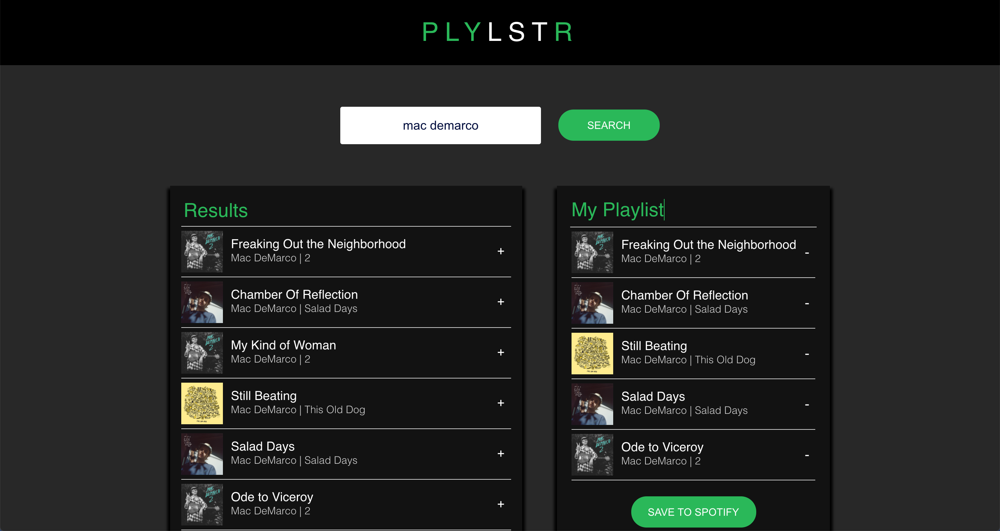

</img>

## PLYLSTR 🎵

PLYLSTR is a React web app with a purpose of allowing users to build playlists which can then be added to their account. It was built using the Spotify API, in which a user can log into their account (via Spotify) allowing Spotify content to be retrieved, playlists to be created and then posted to the user's Spotify account. 

### Technologies Used 💻
- HTML
- CSS
- Javascript
- React
- Spotify API

🌐 <a href="https://plylstr.jonathan-ford.co.uk/">Checkout PLYLSTR on my portfolio</a>
